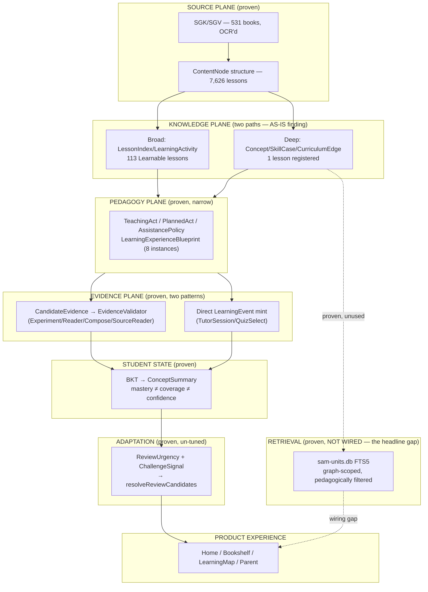

# SAM Education Data Architecture — TO-BE Candidate Proposal

STATUS: **PROPOSAL — NOT AN ARCHITECTURE DECISION.** Review gate: Founder +
GPT approval required. This document authorizes nothing by itself.

Reads on top of `docs/research/SAM-EDUCATION-DATA-ARCHITECTURE-REVIEW.md`
(the AS-IS reconstruction, theory comparison, and counterarguments this
proposal is built from). Every TO-BE item below answers the addendum's
required questions: what problem it solves, what evidence justifies it,
what data changes, what query/decision becomes possible, what product
capability uses it, what UI/UX consumes it, what child/parent value results.

---

## 1. Executive diagram

---

## 2. Data planes — mostly FORMALIZE, not REPLACE

The addendum's candidate 7-plane split (Curriculum/Pedagogy/Source-Retrieval/
Evidence/Student-State/Experience/Adaptation) was proposed as a hypothesis
to challenge. AS-IS evidence shows **SAM already has all seven**, cleanly
separated in code, independently arrived at over ~190 tickets — not as a
unified named model, but as seven real, working modules:

| Plane | AS-IS module | TO-BE change |
|---|---|---|
| Curriculum/Knowledge | `lib/core/curriculum/` (Concept/SkillCase/CurriculumEdge) | **FORMALIZE**: name the two-path split (§3 of review) explicitly as a documented architecture decision, not an implicit accident |
| Pedagogy | `lib/core/pedagogy/` | **RETAIN** — no change justified by evidence |
| Source/Retrieval | `tool/pack/build_retrieval_index.py` + `sam-units.db` | **EXTEND**: wire into Dart runtime (§4 — the one concrete implementation item this proposal recommends) |
| Evidence | `lib/core/student/evidence_validator.dart` + `learning_evidence.dart` | **FORMALIZE**: document why two minting patterns exist (already a deliberate WAL-178 decision) so it reads as architecture, not accident |
| Student State | `lib/core/student/mastery.dart` + `concept_summary.dart` | **RETAIN** — ADR-004 already supersedes the weaker ADR-001 framing; no further change justified |
| Experience/Session | `lib/core/context/learning_context.dart` + `lib/core/intent/learning_intent.dart` | **RETAIN** — WAL-182's `LearningContext` is deliberately not a "Context Engine" yet; no evidence demands one |
| Adaptation | `lib/core/adaptive/` | **RETAIN**, flag constants as un-tuned (already flagged in-repo) |

**No eighth "Product/Family" plane is proposed as new** — `LearnerProfile`/
`Bookshelf`/`Parent` already exist and are covered under Experience/Product
Experience in the review doc's stage table. Splitting it out further is not
justified by any gap this audit found.

---

## 3. Graph model recommendation

**Not a graph database. Not a new graph.** AS-IS already is: a typed,
provenance-gated relational registry (`CurriculumEdge`/`EdgeKind`, JSON/
SQLite storage) with generated graph *views* (`crossgrade-graph.json`,
FTS indexes) — matching the addendum's own preferred hypothesis (§9),
because that hypothesis describes what already exists, not a future state.

**TO-BE recommendation: no infrastructure change.** The graph is not
under-powered by its storage technology — it's under-*populated* (1%
corpus depth). No evidence in this audit suggests a graph database (Neo4j
or equivalent) would solve a problem SQLite+JSON+typed-Dart-classes
currently has. This directly answers addendum §9's challenge: graph
here is best understood as **a conceptual model + a small typed registry
+ generated views** — never a runtime graph-database dependency.

---

## 4. The one concrete TO-BE implementation candidate

**Wire `sam-units.db` (the proven, benchmarked retrieval pack) into one real
Dart query path.**

- **What problem**: closes the single largest "backend proven, invisible to
  product" gap found in this audit (review doc §0/§7) — bigger in scope
  than WAL-193's UI-level instance of the same failure mode.
- **What evidence justifies it**: WAL-81's benchmark (8/8 source recall, 0
  future-knowledge leaks, 0 method-permission violations, filter proven
  load-bearing via a no-filter control showing leak=5/violation=2 on the
  identical index).
- **What data changes**: none — the pack already exists, already builds,
  already passes its own benchmark. Only a Dart consumer needs to be added.
- **What query/decision becomes possible**: "why is SAM teaching this"
  (Query 6) and "what supporting source exists" become answerable from the
  real corpus at query time, instead of only from the 1 hand-registered
  `SliceCurriculum` lesson.
- **What product capability uses it**: Source/Why screens (concept #16/#17,
  already `KEEP khung/REPLACE nội dung` per the 38-concept re-audit) —
  these screens' data-readiness was flagged `R`/`RE` (ready) in
  `06-38-CONCEPT-PRODUCTION-MAP.md`, meaning the UI side is not the blocker.
- **What UI/UX consumes it**: existing `Source`/`Why` screens — no new
  Surface required.
- **What child/parent value results**: "Vì sao SAM dạy như vậy?" answered
  from real, retrieved SGK/SGV text for any lesson in the corpus, not just
  one — extending an already-proven, already-safe capability's reach, at
  the lowest evidence-to-cost ratio of anything else surveyed in this
  proposal (no new theory, no new data, no new extraction — only wiring).

**This is not authorized for implementation by this document** — it is
named as the smallest, highest-confidence V1 candidate *if* Founder
approves moving from research to bounded implementation. Per the Master
Task Order's hard gate (§25), no code changes are made here.

---

## 5. Rejected alternatives

- **Adopt KST/CbKST production infrastructure now**: rejected — prerequisite
  data volume (1 edge) cannot justify or even test the investment (review
  doc §5/§9).
- **Adopt 1EdTech CASE**: rejected — solves a cross-system interoperability
  problem SAM does not have (review doc §5).
- **Introduce a graph database**: rejected — no runtime requirement found
  that SQLite+JSON+typed-Dart doesn't already satisfy (§3).
- **Unify the two evidence-minting patterns immediately**: rejected as a
  now-action — the split was a deliberate, reasoned WAL-178 decision citing
  a real shape difference (Toán/Quiz vs. Reader/Compose/Experiment). Worth
  documenting explicitly (§2), not collapsing without new evidence that the
  shape difference no longer holds.
- **Unify SliceCurriculum (deep) and LessonIndex (broad) paths immediately**:
  rejected as a now-action — this is Open Hypothesis #5 in the review doc;
  no evidence yet says which convergence (if any) is correct. Recommend
  research-more, not implementation, on this specific question.

---

## 6. UI/UX consumers (cross-reference)

See `docs/design/SAM-CONCEPT-DATA-CAPABILITY-MATRIX.md` for the full
concept-by-concept mapping. Summary: every data capability named above
already has a named UI consumer somewhere in the 38-concept set (per
`06-38-CONCEPT-PRODUCTION-MAP.md`'s own "38/38 have an owner, no orphans"
finding) — this proposal does not introduce any capability that lacks a
product destination.

---

## 7. Risks (see review doc §10 for full list)

Carried forward: wiring debt, graph shallowness relative to corpus,
two-evidence-pattern maintenance risk, legibility-gate gap (WAL-193 class).
No new risks introduced by this proposal, since it recommends wiring
existing, already-tested capability rather than building anything new.

---

## 8. Smallest V1

Same as review doc §11: wire `sam-units.db` into one real query path. No
other TO-BE item in this proposal is recommended for action before that
one is evaluated and, if approved, completed — per the Founder's own
vertical-slice-over-horizontal-completion principle.
