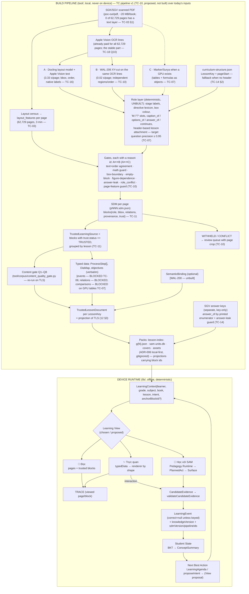

# 13 — Learning View Data Flow (Q9, Q14, Q17, Q18)

> **Reconciled with TC-v1 (2026-09-05).** `TC-nn` = `docs/research/trusted-corpus/nn-….md`. Changes: §1 BUILD subgraph replaced by the TC pipeline v1 stages (proposed, not built); §2 hops for lesson/block/evidence; §5 per-page bytes from TC-16; §7 applied.

**Status:** HYPOTHESIS. Corpus-dependent steps were tagged PENDING TRUSTED-CORPUS FINDINGS at
writing (no bundle on the Desktop); the study's findings now replace them in place.

## 1. Build time vs runtime (the split that keeps Views deterministic)

Reading rule: **nothing is generated at runtime**; the device renders a document it received.
The only runtime computation is pedagogy (which act next) and state (BKT), both already local.
TC-v1 confirms the split from the corpus side: every TC stage is build-time, the VLM is excluded
from the production path (TC-12), and no LLM/VLM may re-guess a block (TC-11 §6). Today's chain
(`PDF → OCR → XY-cut → units → gate → pack`) is stage B alone with a page-level gate; the SDM,
role layer and gates are TC-v1's proposal (TC-10 "to build, not built").

## 2. Provenance survival through transformation (Q9)

The chain the Founder asked for — Book → Chapter → Lesson → Source Page → Source Block/BBox →
Structured Content → Learning View — maps onto existing identifiers at every hop:

| Hop | Identifier that survives | Exists today? | Loss risk |
|---|---|---|---|
| Book | `sourceDocumentId` | yes (`BookRef`, `Provenance.sourceId`) | none |
| Chapter | `ContentNode` role THEME/CHAPTER → SDM `heading_path` | in `tool/`, not in packs | dropped at pack build — FORMALIZE |
| Lesson | `LessonKey` + per-block `lesson{attach_method, confidence}`, `continues` (TC-11) | `LessonKey` yes; attachment fields proposed | TOC-range attachment wrong on 10/38 gold pages; header-based fixes 6 (TC-02 §5, TC-14 §2) |
| Source page | `pdf_page` + `printed_page` (calibrated) | yes, both kept | confusing the two (`provenance.dart:71-75`); TC-09 #9: the printed-page offset decides whether a TOC page attaches to Bài 1 |
| Block / BBox | `blocks[].id` = `<doc>:p<NNN>:<parser>:<n>`, `bbox [x, y, w, h]` normalised (TC-11 §2) | yes in layout (`book:pNNN:bNN`); SDM id proposed | **two bbox conventions** (MEASURED, `12` §2) — **resolved** by TC-11's `[x, y, w, h]`; convert `SourceAsset.bboxFrac` once |
| Structured content | `LessonActivity`, `typedData`, SDM relations, `SemanticBinding.provenance` | partly | typed data without `sourceRef` — forbid by invariant |
| View | render only via `sourceLineForChildOf` (three wordings) and «xem vùng trang» | yes for text; page-region view is HYPOTHESIS | an LLM inventing a citation — blocked by `CITATION_FABRICATION` guard |
| Evidence | `LearningEvent{sourceDocumentId, lessonNo, knowledgeVersion}` (WAL-179 lineage) | yes | add `sdmVersion` + pipeline ids (`provenance.extraction_method`, run id — TC-12) so replay knows which extraction produced the block |

Provenance therefore survives if (a) chapter and extraction version are added to the pack, (b) one
`SourceRef` shape replaces three, and (c) Views are forbidden from rendering unreferenced content.

## 3. Evidence between Views (Q14)

- Mode 1 and Mode 2 (display) → **TRACE** only: `{learnerId, lessonKey, pagePdf?, blockId?, at}`
  — stored so SAM can greet with context; never read by BKT. (Caliper `Viewed`; H5P's
  `progressAuto` is the anti-pattern.)
- Mode 2 interaction / Mode 3 Surface → `CandidateEvidence` → `validateCandidateEvidence` (one
  gate; `lookup` ⇒ null) → `LearningEvent` keyed by `skillCaseId`/`conceptIds` + lesson lineage.
- The View id is **not** stored on the event (Views are presentation); the Surface/policy id is
  (`policyId: reader-v1|experiment-v1|…`). This keeps ONE EVIDENCE TRUTH, MULTIPLE PROJECTIONS (WAL-180).
- Known hygiene gap to close before Views multiply Surfaces: Tutor/Quiz mint events directly
  (Review §3) — a third pattern must not appear.

## 4. Offline / download / cache (Q17)

ADR-006 already decides local-first packs ("BUILD ONCE → DISTRIBUTE → RETRIEVE LOCALLY MANY
TIMES"; signed, versioned deltas). Applied to Views:

| Unit | Contents | Cache/update policy (HYPOTHESIS) |
|---|---|---|
| **Book pack** (per `sourceDocumentId`) | cover, chapter/lesson list, all `TrustedLessonDocument`s (text blocks, typed data, bindings), keys | download on first open from Giá sách; delta-updated by `packVersion`; `knowledgeVersion`/`sdmVersion` pinned into evidence |
| **Page rasters** (per page) | page image (webp) | largest item (≈ 330 KB per 200-dpi page, TC-16); download per lesson range on entering a lesson, or with the book if on Wi-Fi (policy to measure) |
| **Curated assets** | figure/map crops with `bboxFrac` provenance | with the book pack (few) |
| **Retrieval index** (`sam-units.db`) | FTS per grade | with grade pack; no Dart consumer yet |
| **Learner data** | events, TRACE, bookmarks/annotations | device-local JSONL, never in packs |

Views render from cache only; there is no online path in any View (LLM inference for Mode 3
wording is independent of retrieval, per ADR-006, and is shadow today).

## 5. Could structured content materially reduce size? (Q18) — MEASURED inputs

| Artifact | Size (MEASURED) | Scope |
|---|---|---|
| `05-sgk-toan-5-tap-mot.pdf` | 20.2 MB | one book, scanned (~100-ppi, TC-03 §1) |
| `poc-out/pdf` | 11 GB | corpus PDFs (531 docs) |
| `poc-out/layout` | 16 MB | layout JSON for **6** books (≈2.7 MB/book, uncompressed, includes line geometry) |
| `poc-out/units-layout` | 1.9 MB | units for 6 books |
| `lesson-index-g5.json` | 256 KB | grade-5 pack (15 books, activities, no page text) |
| `sam-units.db` | 1.9 MB | FTS retrieval pack |
| `sam-stories.db` | 90 KB | 38 verified stories |
| `covers/*.webp` | small (per book) | 531 covers |
| curated crops (`*.png`) | 0.5 / 1.4 / 4.0 MB | three assets |
| `sam-synthetic-100mb.db` | 105 MB | phone-sim benchmark artifact sitting in `assets/pack/` (bundled into local dev builds because `pubspec.yaml` declares the directory) |
| Docling JSON (raw) — TC-16 | 17.6 KB/page median → ≈ 1.1 GB corpus | all 62,729 pages (extrapolated from 146 pilot pages) |
| XY-cut JSON — TC-16 | 5.8 KB/page → ≈ 0.36 GB | corpus |
| SDM with two stacks + trust — TC-16 | ≈ 30–40 KB/page (ESTIMATED) → ≈ 2–2.5 GB | corpus |
| Page render 200 dpi — TC-16 | ≈ 330 KB/page; ≈ 4 GB if 20 % of pages | review renders (withheld pages) |

Reading: **text-structured content is ≈10× smaller than the PDF per book** (2.7 MB vs 20 MB,
MEASURED here; TC-16 agrees per page — SDM 30–40 KB × ~118 pages/book ≈ 3.5–4.7 MB/book, derived
from 62,729 pages / 531 docs). **Images dominate**: a 200-dpi page render is ≈ 330 KB (TC-16), so a
~118-page book is ≈ 39 MB of rasters — *more* than its 20 MB PDF (derived; the PDF is a ~100-ppi
scan). So the board's "nhẹ hơn, tải theo sách/bài" is **true for text and for per-lesson download
granularity, false for full-resolution rasters**; the deciding factor is a reader-dpi/webp policy
that is **STILL UNMEASURED after TC-v1** (TC-16 measured review renders only) and needs the ADR-006
storage benchmark ("đo bytes từng tầng"). Licensing of page images is a Founder/Legal decision
(OQ8), not a measurement.

## 6. What flows where (one table)

| Data | Source of truth | Mode 1 | Mode 2 | Mode 3 | Parent |
|---|---|---|---|---|---|
| Block text | SDM `TrustedLearningSource` (TC-11) | render | node labels (verbatim) | `DerivedFacts` for guard | drill-down |
| Page image | raster | anchor/fallback; **delivery path** for formula/diagram/table (TC-19 #7) | «xem vùng trang» | «xem lại trong sách» | source check |
| Typed data | extractor + gold set | — | render | scope for acts | — |
| Keys | SGV (separate; `answer_of`, TC-14) | inline check only if keyed | grade interaction only if keyed | grade only if keyed | — |
| Learner state | evidence log | markers only (no %) | markers only | drives `decide()` | `explainConcept` |
| TRACE | device | write | write | read (greeting) | never as knowledge |

## 7. Reconciliation checklist — APPLIED 2026-09-05

- [x] BUILD subgraph replaced by the TC pipeline v1 stages and names (TC-10) — marked proposed, not built; today's chain identified as stage B with a page gate.
- [x] §5 carries TC-16 per-page bytes; per-book reader rasters STILL UNMEASURED after TC-v1.
- [ ] Page rasters licensing: **not measured by TC-v1** — it recommends image-first delivery (TC-19 #7) and leaves governance unchanged (TC-17 #15). Founder/Legal decision (OQ8, `17` §5 C6). Size: measured.
- [x] Versioning adopted: pipeline id in every block's `provenance` + versioned output dir (`tc-v2`) (TC-12); `layoutVersion` renamed `sdmVersion` + `pipelineIds`.
- [x] "No runtime generation" holds: every TC stage is build-time; the VLM is excluded from production (TC-12); LLM/VLM may not re-guess blocks (TC-11 §6).
