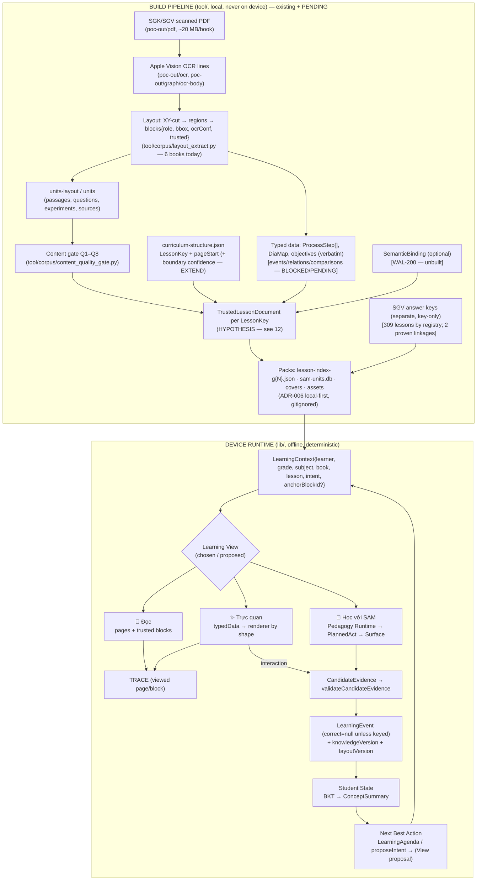

# 13 — Learning View Data Flow (Q9, Q14, Q17, Q18)

**Status:** HYPOTHESIS. Corpus-dependent steps are tagged PENDING TRUSTED-CORPUS FINDINGS; the
study's findings replace them (checklist §7). No Trusted-Corpus bundle existed on the Desktop when
this was written.

## 1. Build time vs runtime (the split that keeps Views deterministic)

Reading rule: **nothing is generated at runtime**; the device renders a document it received.
The only runtime computation is pedagogy (which act next) and state (BKT), both already local.

## 2. Provenance survival through transformation (Q9)

The chain the Founder asked for — Book → Chapter → Lesson → Source Page → Source Block/BBox →
Structured Content → Learning View — maps onto existing identifiers at every hop:

| Hop | Identifier that survives | Exists today? | Loss risk |
|---|---|---|---|
| Book | `sourceDocumentId` | yes (`BookRef`, `Provenance.sourceId`) | none |
| Chapter | `ContentNode` role THEME/CHAPTER | in `tool/`, not in packs | dropped at pack build — FORMALIZE |
| Lesson | `LessonKey` (+ boundary) | yes | boundary uncertainty (`pageStart null`, capped ranges) |
| Source page | `pagePdf` + `pagePrinted` | yes, both kept | confusing the two (`provenance.dart:71-75`) |
| Block / BBox | `blocks[].id` = `book:pNNN:bNN`, `bbox` | yes (layout) | **two bbox conventions** (MEASURED, `12` §2) |
| Structured content | `LessonActivity`, `typedData`, `SemanticBinding.provenance` | partly | typed data without `sourceRef` — forbid by invariant |
| View | render only via `sourceLineForChildOf` (three wordings) and «xem vùng trang» | yes for text; page-region view is HYPOTHESIS | an LLM inventing a citation — blocked by `CITATION_FABRICATION` guard |
| Evidence | `LearningEvent{sourceDocumentId, lessonNo, knowledgeVersion}` (WAL-179 lineage) | yes | add `layoutVersion` so replay knows which extraction produced the block |

Provenance therefore survives if (a) chapter and layout version are added to the pack, (b) one
`SourceRef` shape replaces three, and (c) Views are forbidden from rendering unreferenced content.

## 3. Evidence between Views (Q14)

- Mode 1 and Mode 2 (display) → **TRACE** only: `{learnerId, lessonKey, pagePdf?, blockId?, at}`
  — stored so SAM can greet with context; never read by BKT. (Caliper `Viewed`; H5P's
  `progressAuto` is the anti-pattern.)
- Mode 2 interaction / Mode 3 Surface → `CandidateEvidence` → `validateCandidateEvidence` (one
  gate; `lookup` ⇒ null) → `LearningEvent` keyed by `skillCaseId`/`conceptIds` + lesson lineage.
- The View id is **not** stored on the event (Views are presentation); the Surface/policy id is
  (`policyId: reader-v1|experiment-v1|…`). This keeps ONE EVIDENCE TRUTH, MULTIPLE PROJECTIONS (WAL-180).
- Known hygiene gap to close before Views multiply Surfaces: Tutor/Quiz mint events directly
  (Review §3) — a third pattern must not appear.

## 4. Offline / download / cache (Q17)

ADR-006 already decides local-first packs ("BUILD ONCE → DISTRIBUTE → RETRIEVE LOCALLY MANY
TIMES"; signed, versioned deltas). Applied to Views:

| Unit | Contents | Cache/update policy (HYPOTHESIS) |
|---|---|---|
| **Book pack** (per `sourceDocumentId`) | cover, chapter/lesson list, all `TrustedLessonDocument`s (text blocks, typed data, bindings), keys | download on first open from Giá sách; delta-updated by `packVersion`; `knowledgeVersion`/`layoutVersion` pinned into evidence |
| **Page rasters** (per page) | page image (webp) | largest item; download per lesson range on entering a lesson, or with the book if on Wi-Fi (policy to measure) |
| **Curated assets** | figure/map crops with `bboxFrac` provenance | with the book pack (few) |
| **Retrieval index** (`sam-units.db`) | FTS per grade | with grade pack; no Dart consumer yet |
| **Learner data** | events, TRACE, bookmarks/annotations | device-local JSONL, never in packs |

Views render from cache only; there is no online path in any View (LLM inference for Mode 3
wording is independent of retrieval, per ADR-006, and is shadow today).

## 5. Could structured content materially reduce size? (Q18) — MEASURED inputs

| Artifact | Size (MEASURED, main checkout) | Scope |
|---|---|---|
| `05-sgk-toan-5-tap-mot.pdf` | 20.2 MB | one book, scanned |
| `poc-out/pdf` | 11 GB | corpus PDFs (531 docs) |
| `poc-out/layout` | 16 MB | layout JSON for **6** books (≈2.7 MB/book, uncompressed, includes line geometry) |
| `poc-out/units-layout` | 1.9 MB | units for 6 books |
| `lesson-index-g5.json` | 256 KB | grade-5 pack (15 books, activities, no page text) |
| `sam-units.db` | 1.9 MB | FTS retrieval pack |
| `sam-stories.db` | 90 KB | 38 verified stories |
| `covers/*.webp` | small (per book) | 531 covers |
| curated crops (`*.png`) | 0.5 / 1.4 / 4.0 MB | three assets |
| `sam-synthetic-100mb.db` | 105 MB | phone-sim benchmark artifact sitting in `assets/pack/` (bundled into local dev builds because `pubspec.yaml` declares the directory) |

Reading: **text-structured content is ≈10× smaller than the PDF per book** (2.7 MB vs 20 MB,
before compression; the layout JSON could shrink further by dropping line geometry). **Images
dominate**: one curated map PNG (4 MB) equals a fifth of the book's PDF; page rasters for a whole
book will approach the PDF unless aggressively compressed (webp, lower DPI for the reader,
full-res on zoom). So the board's "nhẹ hơn, tải theo sách/bài" is **true for text and for
per-lesson download granularity, unproven for images** — the deciding factor is the page-raster
and figure policy, which is PENDING TRUSTED-CORPUS FINDINGS (image licensing/size) and needs the
ADR-006 storage benchmark ("đo bytes từng tầng"), not an estimate from PDF size.

## 6. What flows where (one table)

| Data | Source of truth | Mode 1 | Mode 2 | Mode 3 | Parent |
|---|---|---|---|---|---|
| Block text | layout (trusted) | render | node labels (verbatim) | `DerivedFacts` for guard | drill-down |
| Page image | raster | anchor/fallback | «xem vùng trang» | «xem lại trong sách» | source check |
| Typed data | extractor + gold set | — | render | scope for acts | — |
| Keys | SGV (separate) | inline check only if keyed | grade interaction only if keyed | grade only if keyed | — |
| Learner state | evidence log | markers only (no %) | markers only | drives `decide()` | `explainConcept` |
| TRACE | device | write | write | read (greeting) | never as knowledge |

## 7. Reconciliation checklist — when the Trusted Corpus bundle lands

- [ ] Replace the BUILD subgraph stages with the study's pipeline stages and names.
- [ ] Update §5 with the study's per-layer byte measurements if it provides them (ADR-006 item 3).
- [ ] Confirm whether page rasters may be shipped (licence/size) — this decides Mode 1's anchor.
- [ ] Adopt the study's `layoutVersion`/document versioning if defined.
- [ ] Re-check the "no runtime generation" claim against any study step that requires runtime work.
