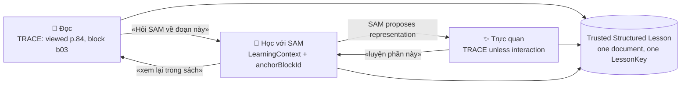

# 16 — UX Concept · Lesson Workspace (no new design system)

Primary reference: the Founder's concept board `concept/concept-ai-first/learning-view.png`
(described in `03` §1). Constraints honoured: existing design language (`docs/design/
DESIGN-SYSTEM-DIRECTION.md` — lavender `#7C4DFF` primary, warm `#FFB800` accent, off-white
`#F7F7FC`, ink `#2D2D3A`, 16–20dp radius, ≥48dp touch), mascot state chips (`assets/mascot/
sam-<state>.png`: hello · listen · think · probe · hint · your-turn · step-back · try-again ·
explain · admit-uncertainty · celebrate-independence · camera-scan · review-due), the four age bands
(`AGE-ADAPTIVE-UX.md`), the converged IA of **three** bottom tabs (`SAM-PRODUCT-EXPERIENCE-
CONVERGENCE.md` §5), and the existing screens (BookShelf → Book Home → intent sheet → Surface).
**Everything below is a HYPOTHESIS for Founder review, not a spec.**

## 1. Board → reconciled (what changes and why)

| Board frame | Keep | Change | Reason |
|---|---|---|---|
| 1 Giá sách, 5-tab nav (Trang chủ · Giá sách · Học cùng SAM · Tiến bộ · Cá nhân) | cover grid, grade filter | **3 tabs**: Hôm nay · Sách của con · Bố mẹ; no "Học cùng SAM" tab, no "Tiến bộ" tab | Convergence §5: SAM lives in the flow, progress lives with parents; §23 no visible progress numbers |
| 2 Book → chapters, "Đã học 3/18 bài · 17%" | Mục lục with Chủ đề → Bài; done mark | **no %**; state per lesson from evidence (`learningMapStateFor` 3-state badge) | Convergence §2 item 2; WAL-181 |
| 3 "Con muốn học theo cách nào?" three cards + "SAM đề xuất" | three visible Views; SAM proposal with a reason | Views appear **after** intent is bound (or intent is proposed in the same sheet); proposal only when a real signal exists, else «Con muốn bắt đầu thế nào?» | `learning_intent.dart` fail-closed `null`; Convergence §8 |
| 4 Mode 1 reader with numbered heading, photo+caption, "Em có biết?", table, pager 3/8 | tab bar Đọc · Trực quan · Học với SAM; reading order; captions; side boxes | **Trusted Fragments over Source Page**: untrusted regions (tables, figures) shown as page-image regions with label; pager by *page*, not by generated section | `04` §2/§4; `layout.tableLike ⇒ untrusted` |
| 5 Mode 2 sub-tabs Sơ đồ tư duy · Sơ đồ quá trình · Bảng tóm tắt | sub-tabs **only for shapes that exist for this lesson** | default = the shape the lesson's data supports (Process for experiments, Map for Địa); "Sơ đồ tư duy" absent until `ConceptRelation[]` exists; "Ghi nhớ cùng SAM" = verbatim glossary/objective lines with provenance, not generated prose | `05` §2 |
| 6 Mode 3 pre-question A–D "Chính xác! 🎉", free-text challenge | SAM opens with a probe; free-text answer | probe is ungraded unless keyed; feedback line reflects evidence («SAM ghi nhận…»); 🎉 only on evidence-backed events; SAM chip hides while the child types | `06` §3; Convergence §6–7 |

## 2. Lesson Workspace — entry (Book Home row → sheet)

```
┌──────────────────────────────────────────────┐
│ ←  Khoa học 4                                 │
│                                              │
│  Bài 23 · Vai trò của chất dinh dưỡng   p.84 │  ← _lessonLabel (existing)
│                                              │
│  🦉(sam-hello)  Mai lớp con có tiết Khoa học. │  ← proposal.reason (existing) or
│                 Xem trước bài này nhé.        │     «Con muốn bắt đầu thế nào?»
│                                              │
│  ▶ 🌱 Mai có tiết này            (proposed)   │  ← intent tiles (existing, WAL-175)
│    🔁 Cô dạy rồi, con ôn lại                  │
│    ✏️ Con có bài tập                          │
│    📖 Xem trong sách                          │  ← lookup, visually lighter (Convergence #1)
└──────────────────────────────────────────────┘
```

Intent stays first (it is the converged model). The **View** is chosen on the next screen, and
SAM may pre-select one with a reason. Nothing new is added to this sheet.

## 3. Lesson Workspace — the three Views (one screen, one segmented control)

```
┌──────────────────────────────────────────────┐
│ ←  Bài 23 · Vai trò của chất dinh dưỡng       │  title + «Xem trang gốc» (page image)
│ ┌──────────┬─────────────┬─────────────────┐ │
│ │ 📖 Đọc   │ ✨ Trực quan │ 🦉 Học với SAM  │ │  segmented control, 48dp, primary-500 on active
│ └──────────┴─────────────┴─────────────────┘ │
│ 🦉(sam-probe) SAM đề xuất: xem Sơ đồ quá trình│  ← ONLY if a deterministic reason exists
│   trước — bài này có thí nghiệm 4 bước.       │     (see §5); else this row is absent
│ ────────────────────────────────────────────── │
│ [ View body ]                                  │
└──────────────────────────────────────────────┘
```

- The segmented control is the **only** new control. Tabs are never disabled silently: a View
  with nothing trusted for this lesson shows SAM's `admit-uncertainty` chip and one line
  («SAM chưa có sơ đồ cho bài này — con xem sách hoặc học cùng SAM nhé»), never an empty canvas.
- Đọc = `intent: lookup` context regardless of which intent was chosen (TRACE only).
- Học với SAM = the chosen intent (prepare/review/practice); the Pedagogy Runtime drives.

### 3a. 📖 Đọc — Trusted Fragments over Source Page

```
│  [ page image p.84, zoomable ]                │  ← SourceAsset-style page raster (anchor)
│  ─ trusted fragments, reading order ─          │
│  1. Các nhóm chất dinh dưỡng          [conf ▮▮▮]│  heading (role=heading)
│  Thức ăn cung cấp cho cơ thể … (body)  [SGK p.84]│  body (trusted) — reflowable, font size
│  ▣ «Hình 23.1 …»  (caption)  [xem vùng trang] │  caption + region image (no figure block exists)
│  ▤ Bảng 23.1 — hiện dưới dạng ảnh trang        │  tableLike ⇒ image region, labelled
│  ❓ Câu hỏi: Kể tên … (question)                │  question block → tap = Surface (READ gate)
│  ⓘ Em có biết? (sidebar)                        │  sidebar role
│                                                 │
│  [Hỏi SAM về đoạn này]  [Đánh dấu]  [Ghi chú]   │  anchorBlockId → LearningContext (HYPOTHESIS)
│  ◀ Trước    trang 84 / 87    Tiếp ▶             │  pager by page
```

Per-block confidence is shown as a quiet glyph, not a percentage (Convergence §2: no % for the
child; confidence here is about *the text*, and parents can drill down on the Source screen #17).
Untrusted page ⇒ page image first, fragments hidden behind «Xem chữ SAM đọc được (chưa chắc)».

### 3b. ✨ Trực quan — one representation, sub-tabs only when ≥2 shapes exist

```
│  [Sơ đồ quá trình]  (Bản đồ)  (Sơ đồ khái niệm — chưa có)   │
│                                                             │
│   CHUẨN BỊ  ─▶  Bước 1  ─▶  Bước 2  ─▶  Bước 3  ─▶  Quan sát │  ← ExperimentActivity.tienHanh[] verbatim
│   «1 đĩa chứa ít đất…»  «Thả đất vào cốc nước…»  [SGK p.5]   │     provenance per node
│                                                             │
│  ▶ Thử: kéo các bước về đúng thứ tự       (interaction)     │  ← CandidateEvidence; order is known ⇒ gradable deterministically (HYPOTHESIS, needs slice)
│  🦉(sam-explain) Vì sao SAM chọn sơ đồ quá trình cho bài này │  ← WAL-185 explanation
```

### 3c. 🦉 Học với SAM — a session, not a chat

```
│ 🦉(sam-probe) Trước khi bắt đầu, con thử trả lời nhé:        │  PlannedAct(diagnosticProbe) — realised via template/guarded
│   «Vì sao chúng ta cần ăn nhiều loại thực phẩm khác nhau?»   │  question verbatim from a trusted `question` block
│                                                              │
│   [ ô trả lời ngắn — gõ hoặc 🎤 ]                            │  Short-Answer Surface (missing today)
│                                                              │
│   (SAM chip hidden while the child types)                    │  Convergence §7
│ ─────────────────────────────────────────────────────────── │
│ 🦉(sam-listen) SAM ghi nhận con đã trả lời. Mình xem lại      │  evidence: independentAttempt correct=null
│   đoạn này trong sách nhé → [mở Đọc tại p.84 ▣]              │  ← View jump with anchor (Mode 3 → Mode 1)
│                                                              │
│  Theo SGK Khoa học 4, trang 84.                              │  sourceLineForChildOf (only wording allowed)
│ ─────────────────────────────────────────────────────────── │
│ 🦉(sam-your-turn) Thử thách tiếp theo: …                     │  next PlannedAct from blueprint/decide()
```

Grading appears **only** when `gradable` (SGV key) — then `feedbackFor` and the
`celebrate-independence` chip for an unaided correct answer.

## 4. Continuity between Views (Q15)



Rule: a jump never re-asks intent; it carries the same `LearningContext`, adding an anchor.

## 5. "SAM đề xuất" — when the recommendation row may appear (Q16, HYPOTHESIS)

The row is rendered only when a **deterministic, explainable** reason exists; the mapping reuses
`proposeIntent`/`LearningAgenda` signals — no new recommender, no LLM:

| Signal (existing) | Proposed View | Child-readable reason |
|---|---|---|
| `reviewDue` / `weakCase` for a SkillCase bound to this lesson | Học với SAM | «Lần trước con còn nhầm phần này — mình luyện lại nhé (~10 phút)» |
| `timetableTomorrow` (prepare) and lesson has an ExperimentActivity | Trực quan (Process) | «Mai có tiết — xem sơ đồ quá trình trước, ~5 phút» |
| `timetableTomorrow` and only readings exist | Đọc | «Mai có tiết — con đọc trước bài này nhé» |
| no signal | *(no row)* | — |

Time estimates («~5 phút») are **not** available from any current data — the board's estimates
would be fabricated. Omit them until a measured per-Surface duration exists (Convergence §23 item
12: no proposal without a traceable reason).

## 6. Fixes to existing screens implied by the concept (already-known defects)

- Lesson activity sheet: distinct labels per reading («📖 Đọc bài · trang 8», «📖 Đọc bài · trang 14»)
  instead of the constant `'📖 Đọc bài'` (`subject_home_screen.dart:650-653`).
- Home mission card: read the Scale path (`nextBookRecommendation`) before saying «SAM chưa có nội
  dung lớp N» (`mission_data.dart:204-229`).
- `MapReaderScreen`: accept `LearningContext` like the other Surfaces (lookup ⇒ TRACE).

## 7. Age bands

Band 3–5 (validation cohort, Convergence §9): segmented control with icons + short labels; SAM
chip present; Mode 1 font ≥16sp. Band 6–9: same control, SAM chip smaller, denser fragments.
Bands 1–2 and 10–12: not designed here (separate passes per `AGE-ADAPTIVE-UX.md`).
